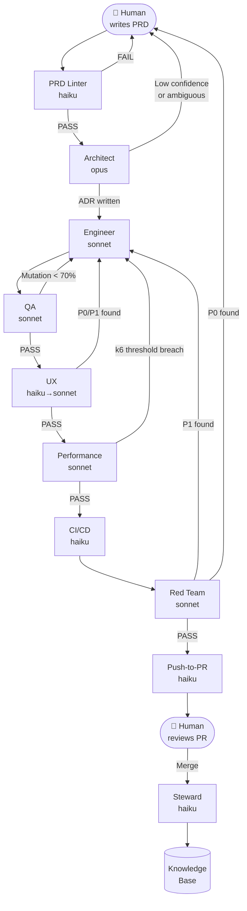
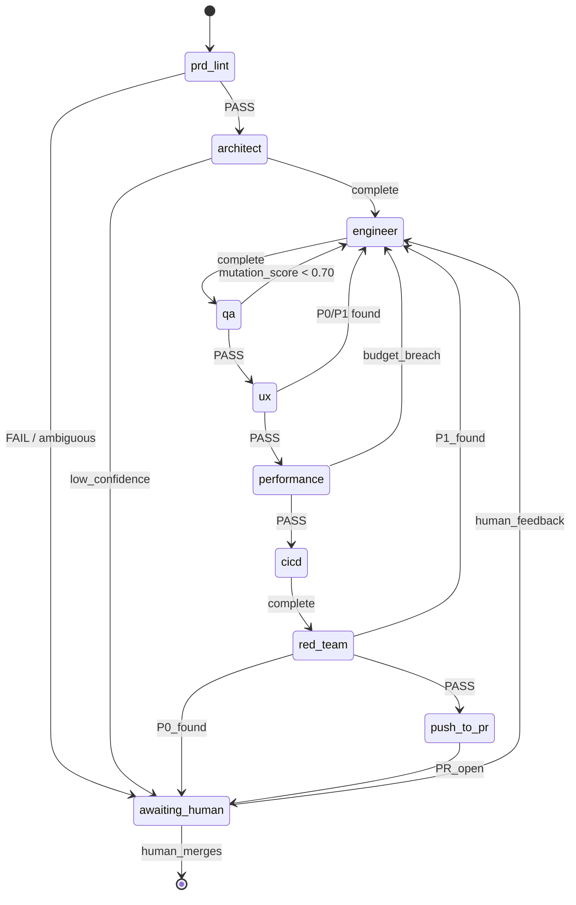
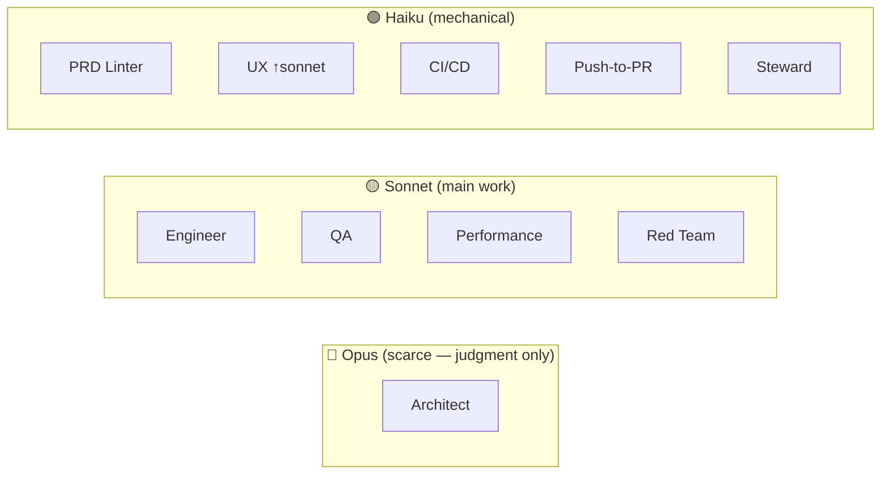
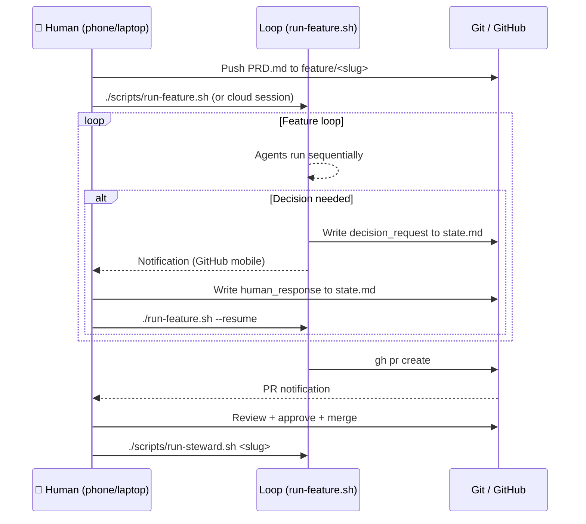

# AI Dev Factory — Architecture

## The Loop

One feature at a time. One active branch. Sequential gates. State lives in git. Agents are stateless.



---

## State Machine (per feature)



---

## Role Roster & Model Assignments



Escalation rule: if role returns `confidence < 0.7` → re-run at next tier. UX starts Haiku, escalates to Sonnet on second loop-back.

---

## File Structure

```
ai-dev-factory/
├── CLAUDE.md                   ← Always-loaded standards (keep lean!)
├── claude-agents/              ← Rename to .claude/agents/ in your project
│   ├── manager.md
│   ├── prd-linter.md
│   ├── architect.md
│   ├── engineer.md
│   ├── qa.md
│   ├── ux.md
│   ├── performance.md
│   ├── cicd.md
│   ├── red-team.md
│   ├── push-to-pr.md
│   └── steward.md
├── templates/
│   ├── PRD.md                  ← Copy for each new feature
│   └── state.md                ← Initialised by run-feature.sh
├── features/
│   └── <slug>/
│       ├── PRD.md              ← Human-authored, never modified by agents
│       ├── state.md            ← Case file (loop state, gate statuses)
│       ├── adr.md              ← Written by Architect
│       ├── assumptions.md      ← Running assumption log
│       ├── ux-review.md        ← Written by UX
│       ├── perf-review.md      ← Written by Performance
│       ├── red-team-findings.md← Written by Red Team
│       ├── pr-description.md   ← Written by Push-to-PR
│       └── metrics.md          ← Per-feature metrics
├── kb/                         ← Generalised how-to knowledge (owned by Steward)
│   ├── INDEX.md
│   ├── engineering/
│   ├── architecture/
│   ├── testing/
│   ├── performance/
│   ├── ux/
│   ├── cicd/
│   ├── security/
│   └── archive/
├── scripts/
│   ├── run-feature.sh          ← Main orchestrator
│   ├── run-steward.sh          ← Post-merge KB ingestion
│   ├── setup-hooks.sh          ← Install git hooks once
│   └── hooks/
│       ├── run-tests.sh        ← Stack-agnostic test runner
│       ├── run-k6.sh           ← k6 performance gate
│       └── secret-scan.sh      ← Pre-commit secret detection
├── tests/
│   └── regression/             ← Red Team writes here — permanent
└── docs/
    ├── architecture.md         ← This file
    └── onboarding.md           ← How to start a feature
```

---

## Human Interaction Model



Human receives a notification and the loop pauses only at:
1. PRD lint failure (ambiguous requirement)
2. Architect low confidence / ambiguous PRD
3. Gate loop-back ceiling (3 failures)
4. Red Team P0 security finding
5. PR is open and ready for review

Everything between a clear PRD and a green PR runs autonomously.

---

## Quality Gates Summary

| Gate | Hard Condition | Enforced By |
|------|---------------|-------------|
| PRD Lint | No ambiguous/untestable criteria | prd-linter agent |
| Assumption Review | confidence ≥ 0.7 or human-approved | manager agent |
| Test Suite | All tests green, no deletions/weakenings | engineer + qa hook |
| Mutation Score | ≥ 70% | qa agent |
| UX | P0/P1 count = 0 | ux agent |
| Performance | k6 thresholds met (p95 < 300ms, errors < 1%) | performance + k6 hook |
| Red Team | P0 count = 0 | red-team agent |
| PR Approval | Human approved | GitHub |

---

## Anti-Gaming Controls

The biggest failure mode of an AI loop: the Engineer goes green by deleting tests or weakening assertions. Three controls prevent this:

1. **QA's test integrity check** — `git diff main` on test files, flags any removed assertion
2. **Mutation testing gate** — ≥ 70% mutation score; easy to pass green tests, hard to game mutations
3. **Human sign-off rule** — any test deletion or assertion weakening escalates to human, no exceptions

---

## The Knowledge Base Compact

Two rules that keep the KB from becoming a swamp:

1. **Generalises, or stays in the feature folder.** "How to handle optimistic locking in PostgreSQL" → KB. "Feature X uses table users" → feature folder only.
2. **Archive, never delete.** Stale content moves to `kb/archive/<date>_<reason>.md`. Hard deletions require human sign-off.

The Steward runs after every merge (for ingestion) and on a weekly scheduled pass (for hygiene). It writes proposals for agent file changes — it never applies them unilaterally.
